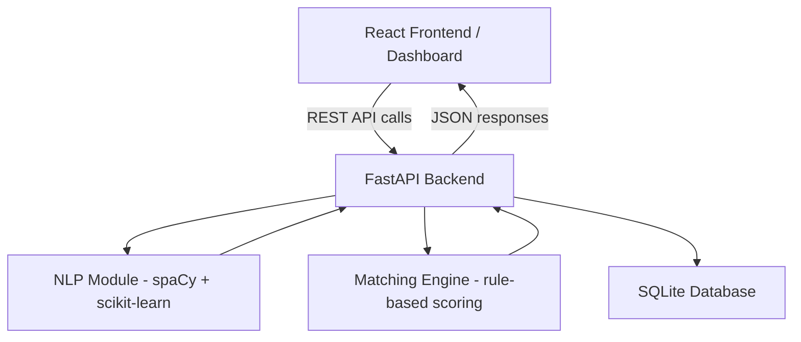
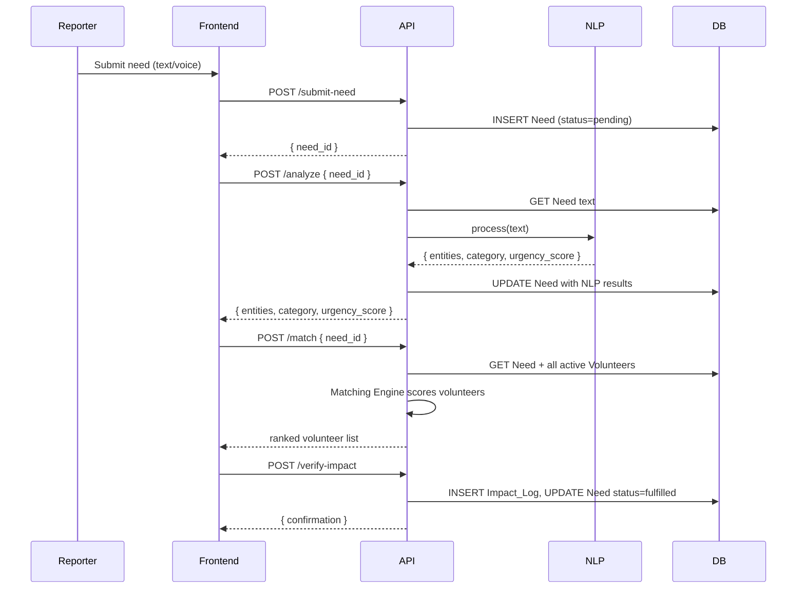

# Design Document: LiveNeed – AI-Powered Smart Resource Allocation Platform

## Overview

LiveNeed is a full-stack web platform built for a 24–48 hour hackathon. It ingests community need reports (text or voice), runs lightweight NLP to extract entities and compute urgency scores, matches volunteers to needs, and tracks fulfillment via a Proof-of-Impact system. The architecture is intentionally simple: a React SPA frontend, a FastAPI backend, spaCy + scikit-learn for AI, and SQLite for persistence.

---

## Architecture

### High-Level System Diagram



### Data Flow



---

## Tech Stack

| Layer | Technology | Rationale |
|---|---|---|
| Frontend | React 18 + Vite | Fast dev setup, component-based UI |
| Styling | Tailwind CSS | Rapid, judge-friendly visual polish |
| Backend | FastAPI (Python 3.11) | Auto-docs, async, minimal boilerplate |
| NLP | spaCy (en_core_web_sm) | Lightweight entity extraction, no GPU needed |
| Scoring | scikit-learn (TF-IDF + keyword rules) | Simple, explainable, fast |
| Database | SQLite via SQLAlchemy | Zero-config, file-based, hackathon-safe |
| Voice Input | Web Speech API (browser-native) | No external service needed |
| Deployment | Render (backend) + Vercel (frontend) | Both have free tiers |

---

## Project Folder Structure

```
live-need/
├── backend/
│   ├── main.py                  # FastAPI app entry point
│   ├── database.py              # SQLAlchemy engine + session
│   ├── models.py                # ORM models
│   ├── schemas.py               # Pydantic request/response schemas
│   ├── routers/
│   │   ├── needs.py             # /submit-need, /analyze, /prioritize
│   │   ├── matching.py          # /match
│   │   └── impact.py            # /verify-impact
│   ├── ai/
│   │   ├── nlp_processor.py     # spaCy entity extraction + category classification
│   │   └── urgency_scorer.py    # Urgency scoring logic
│   ├── matching_engine.py       # Volunteer matching logic
│   └── requirements.txt
├── frontend/
│   ├── src/
│   │   ├── App.jsx
│   │   ├── pages/
│   │   │   ├── Dashboard.jsx    # Main coordinator view
│   │   │   ├── SubmitNeed.jsx   # Reporter input form
│   │   │   └── VolunteerReg.jsx # Volunteer registration
│   │   ├── components/
│   │   │   ├── NeedCard.jsx
│   │   │   ├── StatsBar.jsx
│   │   │   └── VoiceInput.jsx
│   │   └── api.js               # Axios API client
│   ├── index.html
│   └── package.json
└── README.md
```

---

## Python requirements.txt

```
fastapi==0.111.0
uvicorn[standard]==0.29.0
sqlalchemy==2.0.30
pydantic==2.7.1
spacy==3.7.4
scikit-learn==1.4.2
numpy==1.26.4
python-multipart==0.0.9
httpx==0.27.0
pytest==8.2.0
hypothesis==6.100.0
```

> After install, run: `python -m spacy download en_core_web_sm`

---

## Components and Interfaces

### NLP Module (`ai/nlp_processor.py`)

**Responsibilities**: Entity extraction, need category classification.

```python
def process_need_text(text: str) -> NLPResult:
    """
    Returns:
        NLPResult(
            entities: dict[str, list[str]],  # {location, person, org}
            category: str,                   # food|medical|shelter|safety|education|other
            urgency_signals: list[str]        # matched keywords
        )
    """
```

**Category classification** uses a keyword-to-category mapping dict. spaCy's `en_core_web_sm` extracts GPE (location), PERSON, and ORG entities.

Category keyword map:
```python
CATEGORY_KEYWORDS = {
    "food":      ["food", "hungry", "starving", "meal", "water", "nutrition"],
    "medical":   ["medical", "doctor", "hospital", "injury", "sick", "medicine", "ambulance"],
    "shelter":   ["shelter", "homeless", "housing", "roof", "flood", "displaced"],
    "safety":    ["danger", "violence", "fire", "attack", "threat", "unsafe"],
    "education": ["school", "learning", "children", "books", "teacher", "class"],
}
```

### Urgency Scorer (`ai/urgency_scorer.py`)

**Responsibilities**: Compute a 0–100 urgency score from NLP signals.

**Scoring formula**:

```
urgency_score = base_category_score
              + keyword_bonus
              + recency_bonus
              (capped at 100)
```

| Component | Value |
|---|---|
| Base category score | safety=40, medical=35, shelter=25, food=20, education=10, other=5 |
| Emergency keyword bonus | +30 per match (keywords: "emergency", "critical", "urgent", "dying", "fire", "attack") |
| Recency bonus | +10 if submitted within last 1 hour |

This is intentionally rule-based — no model training required, fully explainable to judges.

### Matching Engine (`matching_engine.py`)

**Responsibilities**: Score and rank volunteers for a given need.

```python
def match_volunteers(need: Need, volunteers: list[Volunteer]) -> list[MatchResult]:
    """
    Returns volunteers sorted by match_score descending.
    match_score = skill_score + proximity_score
    """
```

**Skill score**: +50 if volunteer has a skill tag matching the need category. +10 for each additional relevant tag.

**Proximity score**: Computed from lat/lon distance using the Haversine formula. Max +50 for same location, scaled linearly to 0 at 100km.

```python
CATEGORY_TO_SKILL = {
    "medical":   "medical",
    "food":      "logistics",
    "shelter":   "construction",
    "safety":    "general",
    "education": "education",
}
```

---

## Data Models

### SQLAlchemy ORM Models (`models.py`)

```python
class User(Base):
    __tablename__ = "users"
    id: int (PK)
    name: str
    email: str (unique)
    role: str          # "volunteer" | "coordinator"
    skills: str        # comma-separated tags
    latitude: float
    longitude: float
    is_active: bool    # default True
    created_at: datetime

class Need(Base):
    __tablename__ = "needs"
    id: int (PK)
    raw_text: str
    category: str      # food|medical|shelter|safety|education|other
    urgency_score: float
    entities: str      # JSON string
    status: str        # pending|assigned|fulfilled
    location_hint: str # optional free-text location from reporter
    submitted_at: datetime
    updated_at: datetime

class Assignment(Base):
    __tablename__ = "assignments"
    id: int (PK)
    need_id: int (FK -> needs.id)
    volunteer_id: int (FK -> users.id)
    assigned_at: datetime
    status: str        # active|completed

class ImpactLog(Base):
    __tablename__ = "impact_logs"
    id: int (PK)
    need_id: int (FK -> needs.id)
    volunteer_id: int (FK -> users.id)
    notes: str
    photo_url: str     # optional
    verified_at: datetime
```

### Pydantic Schemas (`schemas.py`)

```python
# Request
class SubmitNeedRequest(BaseModel):
    raw_text: str
    location_hint: str | None = None

class AnalyzeRequest(BaseModel):
    need_id: int

class MatchRequest(BaseModel):
    need_id: int

class VerifyImpactRequest(BaseModel):
    need_id: int
    volunteer_id: int
    notes: str | None = None
    photo_url: str | None = None

# Response
class NeedResponse(BaseModel):
    id: int
    raw_text: str
    category: str
    urgency_score: float
    status: str
    entities: dict
    submitted_at: datetime

class VolunteerMatchResult(BaseModel):
    volunteer_id: int
    name: str
    skills: list[str]
    match_score: float
    distance_km: float | None
```

---

## API Design

### POST /submit-need
- **Input**: `{ raw_text: str, location_hint?: str }`
- **Output**: `{ need_id: int, status: "pending" }`
- **Side effects**: Inserts Need row with status=pending

### POST /analyze
- **Input**: `{ need_id: int }`
- **Output**: `{ entities: dict, category: str, urgency_score: float }`
- **Side effects**: Updates Need row with NLP results and urgency score

### GET /prioritize
- **Input**: none (query param `?status=active` optional)
- **Output**: `[ NeedResponse ]` sorted by urgency_score DESC

### POST /match
- **Input**: `{ need_id: int }`
- **Output**: `{ matches: [ VolunteerMatchResult ] }`
- **Side effects**: none (read-only scoring)

### POST /verify-impact
- **Input**: `{ need_id: int, volunteer_id: int, notes?: str, photo_url?: str }`
- **Output**: `{ impact_log_id: int, confirmed: true }`
- **Side effects**: Inserts ImpactLog, updates Need status=fulfilled, updates Assignment status=completed

---

## Correctness Properties

*A property is a characteristic or behavior that should hold true across all valid executions of a system — essentially, a formal statement about what the system should do. Properties serve as the bridge between human-readable specifications and machine-verifiable correctness guarantees.*

### Property 1: Non-empty submission always creates a need

*For any* non-empty, non-whitespace need description, submitting it via POST /submit-need should result in a new Need record in the database with a unique ID and status "pending".

**Validates: Requirements 1.1, 1.3**

---

### Property 2: Whitespace-only submissions are rejected

*For any* string composed entirely of whitespace characters (spaces, tabs, newlines), submitting it as a need description should be rejected and the total count of Need records should remain unchanged.

**Validates: Requirements 1.2**

---

### Property 3: Urgency score is always in range

*For any* need text, the computed Urgency_Score should always be a number in the closed interval [0, 100].

**Validates: Requirements 3.1**

---

### Property 4: Emergency keywords produce high urgency

*For any* need text that contains at least one emergency keyword ("emergency", "critical", "urgent", "dying", "fire", "attack"), the computed Urgency_Score should be at least 70.

**Validates: Requirements 3.4**

---

### Property 5: NLP output is always a valid structured object

*For any* non-empty need text, the NLP_Module should return a structured result containing at minimum a `category` field (one of the six defined values) and an `urgency_signals` list, never raising an unhandled exception.

**Validates: Requirements 2.3, 2.4**

---

### Property 6: Category is always one of the defined values

*For any* need text, the category returned by the NLP_Module should be one of: food, medical, shelter, safety, education, other.

**Validates: Requirements 2.2**

---

### Property 7: Prioritize returns needs in descending urgency order

*For any* collection of active needs with distinct urgency scores, GET /prioritize should return them in descending order of Urgency_Score (i.e., for any adjacent pair in the result, the first item's score ≥ the second item's score).

**Validates: Requirements 3.3, 7.1**

---

### Property 8: Matching excludes already-assigned volunteers

*For any* need and any volunteer who already has an active assignment, that volunteer should not appear in the match results for any other need.

**Validates: Requirements 5.4**

---

### Property 9: Match scores are non-negative

*For any* volunteer and need pair, the computed match score should be ≥ 0.

**Validates: Requirements 5.2**

---

### Property 10: Proof-of-impact round trip

*For any* valid assignment (volunteer assigned to a need), submitting a proof-of-impact should result in: an ImpactLog record existing in the database, and the associated Need's status being "fulfilled".

**Validates: Requirements 6.1, 6.2**

---

### Property 11: Duplicate proof-of-impact is rejected

*For any* need already marked "fulfilled", submitting another proof-of-impact for the same need should return an error and not create a duplicate ImpactLog entry.

**Validates: Requirements 6.3**

---

## Error Handling

| Scenario | HTTP Status | Response |
|---|---|---|
| Empty/whitespace need text | 422 | `{ detail: "Need description cannot be empty" }` |
| Need ID not found | 404 | `{ detail: "Need not found" }` |
| Volunteer ID not found | 404 | `{ detail: "Volunteer not found" }` |
| Duplicate email on registration | 409 | `{ detail: "Email already registered" }` |
| Proof on already-fulfilled need | 409 | `{ detail: "Need is already fulfilled" }` |
| Unauthorized proof submission | 403 | `{ detail: "Volunteer not assigned to this need" }` |
| Malformed request body | 422 | FastAPI default Pydantic validation error |

All errors follow FastAPI's standard `{ "detail": "..." }` envelope.

---

## Testing Strategy

### Dual Testing Approach

Both unit tests and property-based tests are used. Unit tests cover specific examples and edge cases; property tests verify universal correctness across randomized inputs.

### Property-Based Testing

- Library: **Hypothesis** (Python)
- Minimum 100 iterations per property test
- Each test is tagged with a comment referencing the design property

Tag format: `# Feature: live-need, Property {N}: {property_text}`

Each correctness property above maps to exactly one Hypothesis `@given` test.

### Unit Testing

- Framework: **pytest**
- Focus areas:
  - API endpoint integration (using FastAPI `TestClient`)
  - NLP module with known inputs (e.g., "urgent medical help needed" → category=medical, score≥70)
  - Matching engine with controlled volunteer/need fixtures
  - Database persistence (insert → query → verify)
  - Error conditions (404, 409, 403, 422 responses)

### Test File Layout

```
backend/
└── tests/
    ├── test_nlp_processor.py      # Unit + property tests for NLP
    ├── test_urgency_scorer.py     # Unit + property tests for scoring
    ├── test_matching_engine.py    # Unit + property tests for matching
    ├── test_api_needs.py          # API integration tests
    ├── test_api_impact.py         # Proof-of-impact API tests
    └── conftest.py                # Shared fixtures (test DB, client)
```

---

## Deployment Plan

### Backend (Render Free Tier)

1. Push `backend/` to a GitHub repo
2. Create a new Render **Web Service**, connect the repo
3. Build command: `pip install -r requirements.txt && python -m spacy download en_core_web_sm`
4. Start command: `uvicorn main:app --host 0.0.0.0 --port $PORT`
5. SQLite file persists on Render's ephemeral disk (sufficient for demo)

### Frontend (Vercel Free Tier)

1. Push `frontend/` to GitHub
2. Import project in Vercel, set framework to Vite
3. Set env var `VITE_API_URL` to the Render backend URL
4. Deploy — Vercel auto-builds on push

### Demo Day Checklist

- Seed database with 5–10 sample needs and 3–5 volunteers via a `seed.py` script
- FastAPI `/docs` (Swagger UI) available for live judge demo of API
- Dashboard shows live urgency-sorted need cards with color-coded severity
